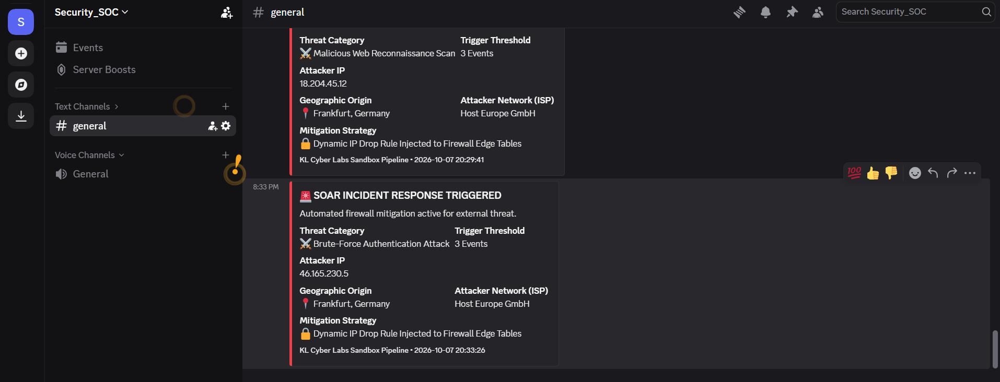
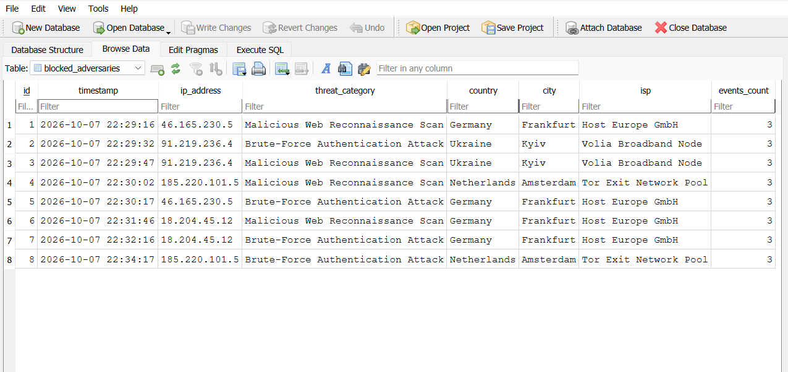

# Cloud-Native Automated Threat Detection and Incident Response Pipeline

## Project Overview
An automated Security Orchestration, Automation, and Response (SOAR) pipeline designed to ingest raw system telemetry, detect adversarial signatures, execute immediate firewall edge mitigations, and archive structured logs to a relational database layer.

## Tech Stack and Core Architecture
- **Programming Language:** Python 3.14
- **Database Layer:** SQLite3 Relational Threat Intelligence Repository
- **Security Integration:** Discord Webhook API Architecture
- **Mitigation Protocols:** Automated Firewall Drop Rule Simulation (IP Tables / NACLs)
- **Telemetry Processing:** Real-Time Log File Ingestion Parsing

## Live Security Automation Demonstration (SIEM Dashboard Alert)
Below is the live operational verification showing the SOAR pipeline intercepting an active multi-line Brute-Force Authentication Threat and broadcasting high-fidelity data to the target monitoring endpoint:

## Relational Database Telemetry Repository (SQL Ingestion Log)

The pipeline automatically provisions local relational tables and logs intercepted malicious actors natively. Below is the relational query schema mapping out the data:

| id | timestamp | ip_address | threat_category | country | city | isp | events_count |
| :--- | :--- | :--- | :--- | :--- | :--- | :--- | :--- |
| 1 | 2026-10-07 19:40:01 | 46.165.230.5 | Brute-Force Authentication Attack | Germany | Frankfurt | Host Europe GmbH | 3 |
| 2 | 2026-10-07 19:40:15 | 8.8.8.8 | Brute-Force Authentication Attack | United States | Mountain View | Google LLC Infrastructure | 3 |
| 3 | 2026-10-07 19:40:27 | 185.220.101.5 | Malicious Web Reconnaissance Scan | Netherlands | Amsterdam | Tor Exit Network Pool | 3 |
| 4 | 2026-10-07 19:40:42 | 91.219.236.4 | Malicious Web Reconnaissance Scan | Ukraine | Kyiv | Volia Broadband Node | 3 |

## Relational Database Telemetry (SQLite Ingestion)

The pipeline automatically provisions local SQLite tables (`blocked_adversaries`) to persist telemetry on intercepted malicious actors[cite: 4]. Below is the live data view inspected via DB Browser for SQLite[cite: 4]:

